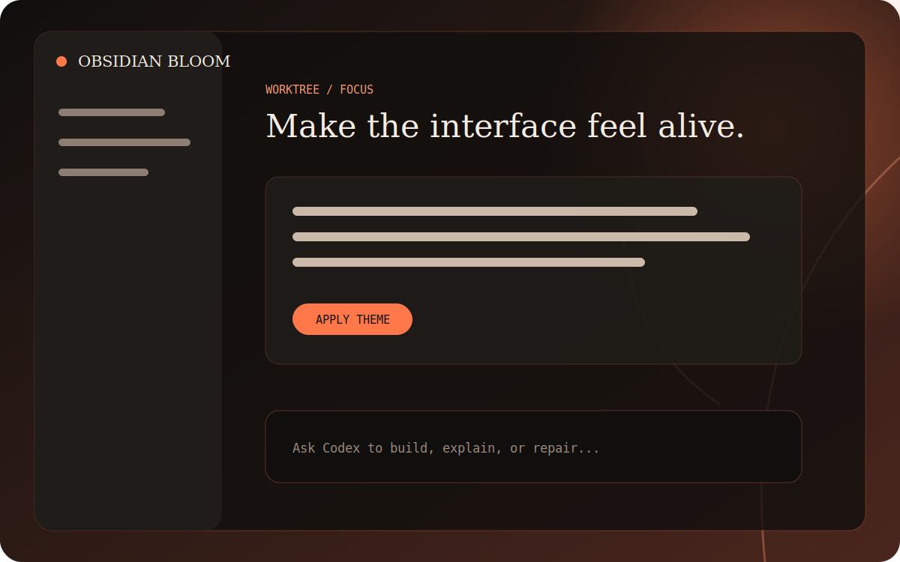

# Awesome Codex Themes

An unofficial, Mac-first open-source theme engine and visual gallery for the official Codex Desktop app.

[](https://github.com/erickkkyt/Awesome-codex-themes/actions/workflows/ci.yml)
[](LICENSE)
[](#compatibility)



Awesome Codex Themes gives technical users a small, inspectable way to apply full-workspace visuals to Codex: local artwork, glass surfaces, theme tokens, diagnostics, an idempotent watcher, and an explicit restore path. It does not patch or redistribute the official application.

## Current status

This repository is an experimental `0.2.0` implementation, not a commercial desktop app.

| Surface | Status |
| --- | --- |
| Theme manifest and local asset validation | Implemented and tested |
| macOS app identity, signature, Team ID, architecture checks | Implemented and tested |
| Literal `127.0.0.1` CDP target and port-owner validation | Implemented and tested |
| Apply, watcher, status, and restore engine | Implemented and tested |
| Versioned full-workspace adapter for Codex `26.707.*` | Implemented and tested |
| Obsidian Bloom schema-v2 full theme | Complete semantic palette; compatibility remains experimental |
| Three original legacy themes | Included for compatibility; not yet tuned for full-workspace coverage |
| Searchable static gallery | Implemented and production-build verified |
| Signed GUI / Commercial Desktop | Out of scope |

Every included theme currently declares Codex `26.707.*`. Unknown versions fail closed and leave the official UI unchanged.

### Full-theme coverage

The shared `26.707` adapter maps a theme's semantic palette onto Codex and VS Code renderer tokens plus narrowly scoped component rules. Obsidian Bloom is the first package tuned against the complete palette. It covers:

- canvas artwork, scrims, main surfaces, sidebars, headers, cards, dialogs, menus, listboxes, and tooltips;
- primary, secondary, muted, and disabled text plus icon tiers;
- normal, subtle, strong, focus, input, menu, and terminal borders;
- inputs, placeholders, Composer, send button, links, hover, active, focus, and selection states;
- code blocks, preformatted text, Monaco/terminal surfaces, added/removed diff colors, status colors, and scrollbars.

“Full-theme” means high coverage on a declared Codex version family. It does not mean future Codex versions are permanently pixel-compatible. Themes remain `experimental` until the relevant page matrix has recorded runtime evidence.

Run one theme injector at a time. A third-party injector can win the CSS cascade with its own high-specificity rules; Awesome Codex Themes deliberately does not remove or rewrite unrelated style elements.

## Safety model

- Validates bundle identifier `com.openai.codex`, intact code signature, and OpenAI Team ID `2DC432GLL2`.
- Uses the Node runtime bundled with the signed official app; end users do not need a global Node installation.
- Binds CDP to a dynamically selected port on literal `127.0.0.1` and verifies the listener belongs to the official app process.
- Selects only the expected main `app://-/index.html` renderer.
- Injects one namespaced style element and owned CSS variables; applying twice replaces the same state.
- Never reads conversations, account tokens, API keys, model settings, or unrelated user data.
- Never patches `app.asar`, modifies the signed app bundle, or silently terminates an active Codex session.
- Records exact watcher process identity before it will send `SIGTERM`; it never terminates the official app.

Read [SECURITY.md](SECURITY.md) and [docs/SAFETY.md](docs/SAFETY.md) before testing the runtime engine.

## Quick start

Requirements:

- macOS on the same architecture as the installed official Codex Desktop app.
- A signed official `ChatGPT.app` or legacy `Codex.app` installation.
- A Codex version declared by the selected theme.

Clone the repository, then inspect without changing app state:

```bash
git clone https://github.com/erickkkyt/Awesome-codex-themes.git
cd Awesome-codex-themes
./bin/awesome-codex-themes doctor
./bin/awesome-codex-themes list
```

For a managed themed session, first quit Codex yourself, then run:

```bash
./bin/awesome-codex-themes start obsidian-bloom
./bin/awesome-codex-themes status
```

Return to the official UI:

```bash
./bin/awesome-codex-themes restore
```

`start` refuses to proceed while Codex is already running. It does not close the app for you.

### Advanced one-shot apply

If you intentionally started the official app with a loopback CDP port, you can apply and restore against that explicit port:

```bash
./bin/awesome-codex-themes apply obsidian-bloom --port 9341
./bin/awesome-codex-themes restore --port 9341
```

The same signature, ownership, listener-address, renderer, and version checks still apply.

## Commands

| Command | Purpose |
| --- | --- |
| `list` | Validate and list installed theme packages. |
| `doctor` | Report signed app path, version, and exact running app PIDs without mutation. |
| `start <theme>` | Launch a new managed Codex session on a dynamic loopback port and start the watcher. |
| `apply <theme> --port <port>` | Apply once to an explicitly CDP-enabled official app. |
| `status` | Report whether this project owns an active managed state record. |
| `restore [--port <port>]` | Remove owned CSS; managed restore also stops only the exact recorded watcher. |

All errors use stable codes such as `APP_SIGNATURE_INVALID`, `CDP_PORT_OWNER_INVALID`, `THEME_APP_VERSION_UNSUPPORTED`, and `INJECTOR_IDENTITY_MISMATCH`.

## Launch collection

- **Arctic Signal** — polar night, cyan telemetry, high contrast.
- **Obsidian Bloom** — charcoal glass and ember-orange botanical forms.
- **Paper Circuit** — warm paper, graphite type, cobalt drafting traces.
- **Solar Archive** — a midnight reading room with amber orbital marks.

Artwork is original, stored locally, and released under CC0 1.0. Theme CSS and engine code are MIT licensed. Each package carries its own `ASSET_LICENSE.md`.

Run the gallery locally:

```bash
pnpm install
pnpm dev
```

The gallery is a static Vite build with search, category filters, structured theme details, and copyable CLI commands. It has no accounts, analytics, payments, or remote theme execution.

## Theme authoring

New full-workspace themes use schema v2 and remain declarative. The versioned adapter owns Codex selectors; packages provide the semantic palette, original artwork, metadata, and optional namespaced refinements:

```text
themes/my-theme/
├── theme.json
├── theme.css
├── background.svg
├── preview.svg
└── ASSET_LICENSE.md
```

Start with [docs/THEME_SCHEMA.md](docs/THEME_SCHEMA.md). Theme paths must remain inside the package; CSS cannot import remote resources or executable URLs; artwork and compatibility licensing must be explicit.

Validate a contribution with:

```bash
pnpm themes:validate
pnpm check
```

See [CONTRIBUTING.md](CONTRIBUTING.md) for the review checklist.

## Development

```bash
pnpm install
pnpm test
pnpm typecheck
pnpm build
pnpm check
```

The engine is written with Node built-ins. React/Vite power only the static gallery and development toolchain. The repository intentionally remains one package until a real product boundary justifies a monorepo.

## Independent implementation

The runtime architecture was researched against [Codex-Dream-Skin](https://github.com/Fei-Away/Codex-Dream-Skin) and [codex-app-transfer](https://github.com/Cmochance/codex-app-transfer), both MIT licensed at the inspected commits. Awesome Codex Themes is an independent, narrower implementation; no upstream artwork, branding, model relay, provider configuration, or source files are included. See [THIRD_PARTY_NOTICES.md](THIRD_PARTY_NOTICES.md) for exact references.

The gallery uses familiar information-architecture patterns from open prompt libraries—visual cards, structured tags, search, filters, and small declarative contributions—without copying their code or assets.

## License and trademark notice

Code is available under the [MIT License](LICENSE). Original launch artwork is CC0 1.0 as documented per theme.

Awesome Codex Themes is unofficial and is not affiliated with, endorsed by, or sponsored by OpenAI. “OpenAI” and “Codex” are trademarks of their respective owner. This project does not ship OpenAI logos or the official app.
