<p align="center">
  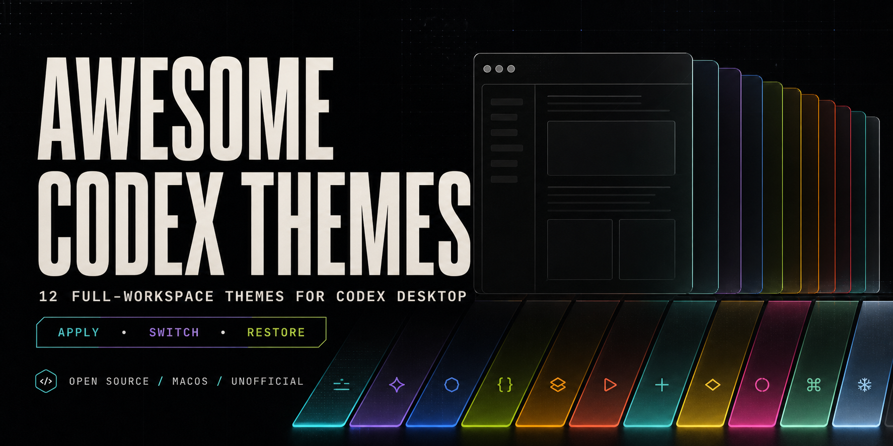
</p>

<h1 align="center">Awesome Codex Themes</h1>

<p align="center">
  <strong>Twelve full-workspace visual themes for Codex Desktop on macOS.</strong><br>
  Apply, switch, persist, diagnose, and restore themes through a local open-source engine.
</p>

<p align="center">
  <a href="https://github.com/BeatAPI/Awesome-codex-themes/actions/workflows/ci.yml"></a>
  <a href="LICENSE"></a>
  
  
</p>

Awesome Codex Themes is an unofficial, Mac-first theme engine and visual collection for the official Codex Desktop app. It applies local artwork, semantic color tokens, glass surfaces, and bounded decorative chrome through a loopback-only Chrome DevTools Protocol connection. It does not patch the signed app bundle, create another Codex profile, or read conversations and credentials.

## Theme collection

Every theme below is a complete local package under `themes/`. The left image is the background used by the runtime package; the right image is its matching marketing asset. Compatibility remains `experimental` and is declared per package.

### 01. Satoru Gojo (五条 悟) — Featured

> A porcelain-white editorial workspace shaped by Limitless, Six Eyes, iris-violet telemetry, and a midnight code cockpit.

| Background | Marketing asset |
| --- | --- |
|  | 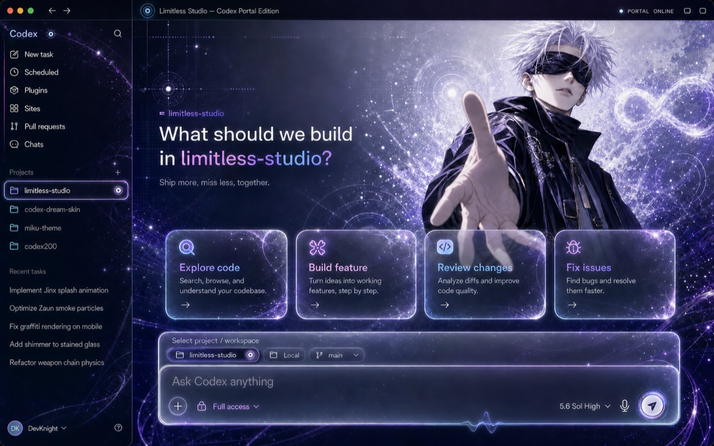 |

```bash
./bin/awesome-codex-themes install-agent satoru-gojo --takeover-at-login
```

### 02. Zaun Workshop

> A volatile undercity workshop framed by fractured stained glass, bridge ironwork, chemical smoke, and kinetic diagonal motion.

| Background | Marketing asset |
| --- | --- |
| 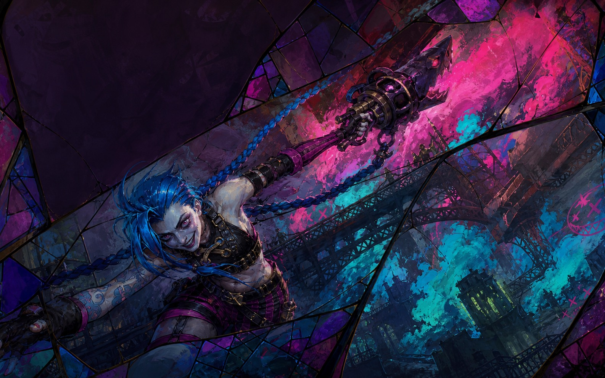 | 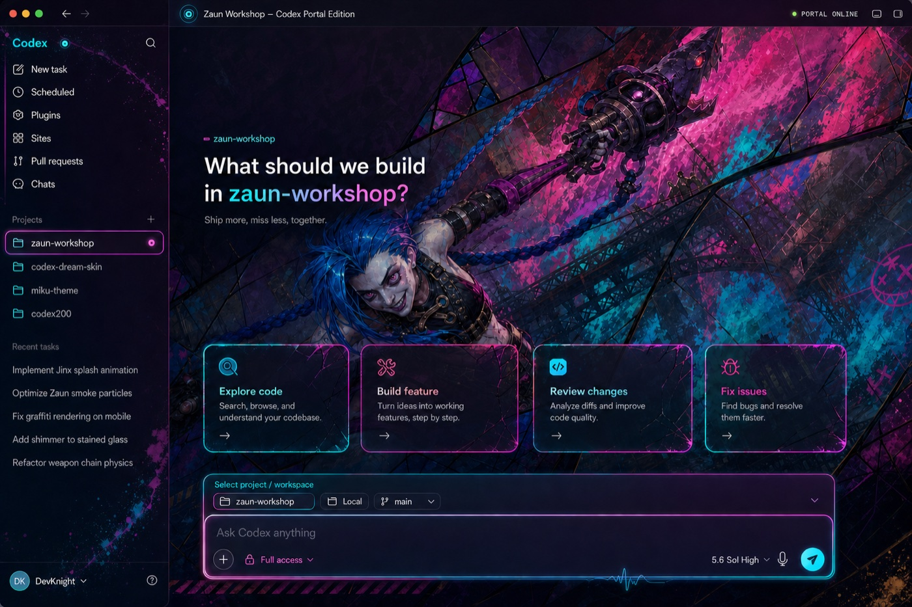 |

```bash
./bin/awesome-codex-themes switch zaun-workshop
```

### 03. Symbiote Sumi-e

> A monochrome symbiote emerging from rice-paper negative space, ink blooms, brush drag, and sparse gold repair seams.

| Background | Marketing asset |
| --- | --- |
|  | 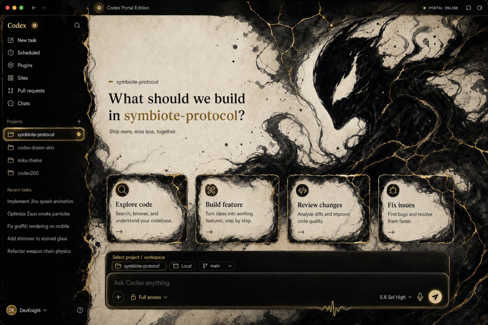 |

```bash
./bin/awesome-codex-themes switch symbiote-sumi-e
```

### 04. Slingshot Lab

> A bright island construction lab where timber, stone, glass blocks, tension bands, and projectile arcs form the system language.

| Background | Marketing asset |
| --- | --- |
|  | 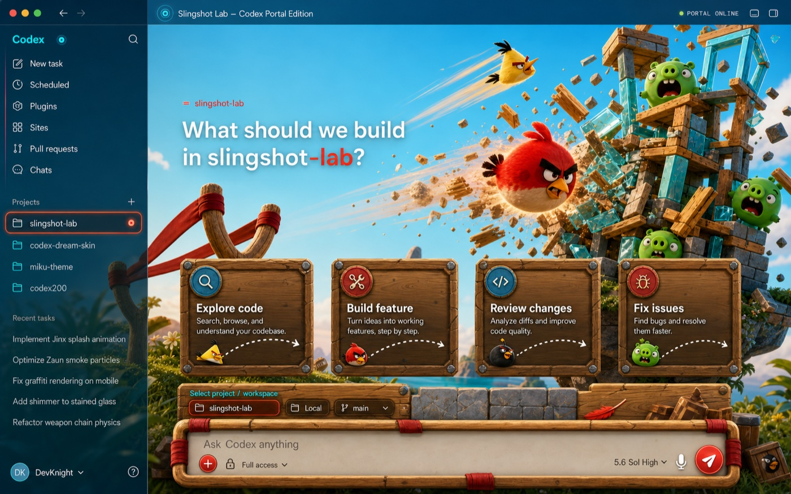 |

```bash
./bin/awesome-codex-themes switch slingshot-lab
```

### 05. Saiyan Ukiyo-e

> A parchment-and-indigo battle chronicle using ukiyo-e brush rhythm, orange energy, wave motion, and carved seal logic.

| Background | Marketing asset |
| --- | --- |
|  | 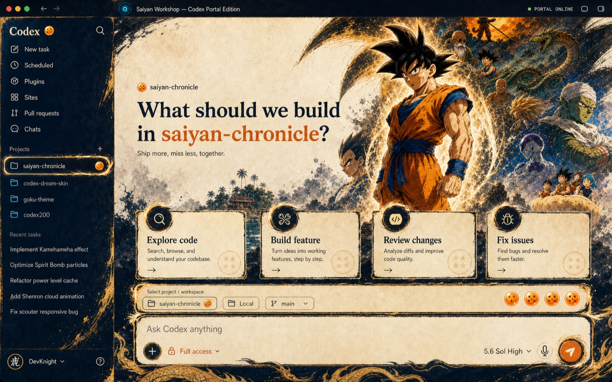 |

```bash
./bin/awesome-codex-themes switch saiyan-ukiyoe
```

### 06. Grand Line

> A weathered black-sail navigation desk illuminated by brass chart marks, rope, smoke, and a high-energy captain portrait.

| Background | Marketing asset |
| --- | --- |
| 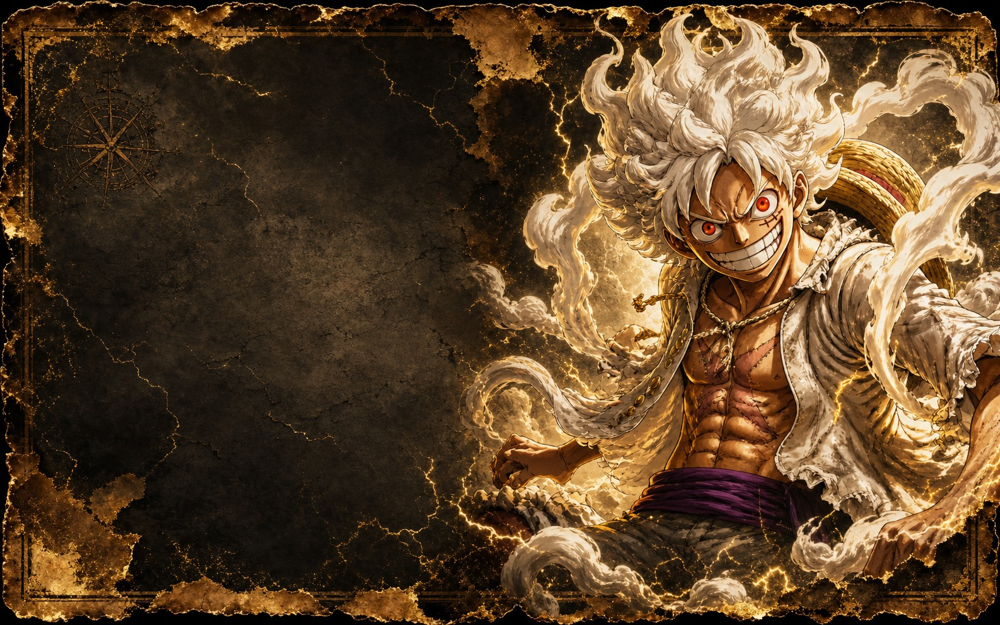 | 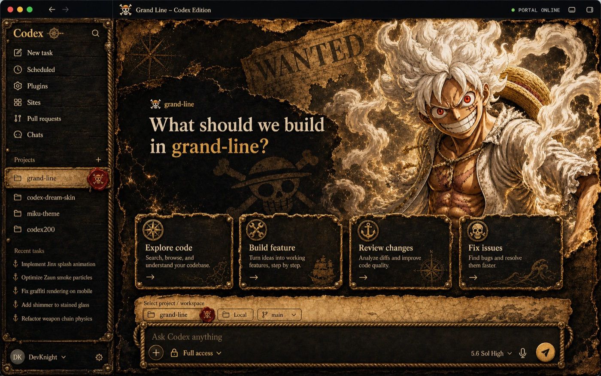 |

```bash
./bin/awesome-codex-themes switch grand-line
```

### 07. Castle Archive

> A monumental candlelit castle interior built from black columns, burgundy velvet, ivory fabric, and brass archival details.

| Background | Marketing asset |
| --- | --- |
|  | 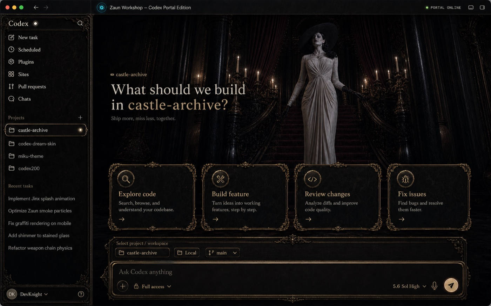 |

```bash
./bin/awesome-codex-themes switch castle-archive
```

### 08. Overworld Realms

> A cross-section of bright overworld village, deep mineral cave, lava seam, and violet portal rendered as an isometric voxel system.

| Background | Marketing asset |
| --- | --- |
| 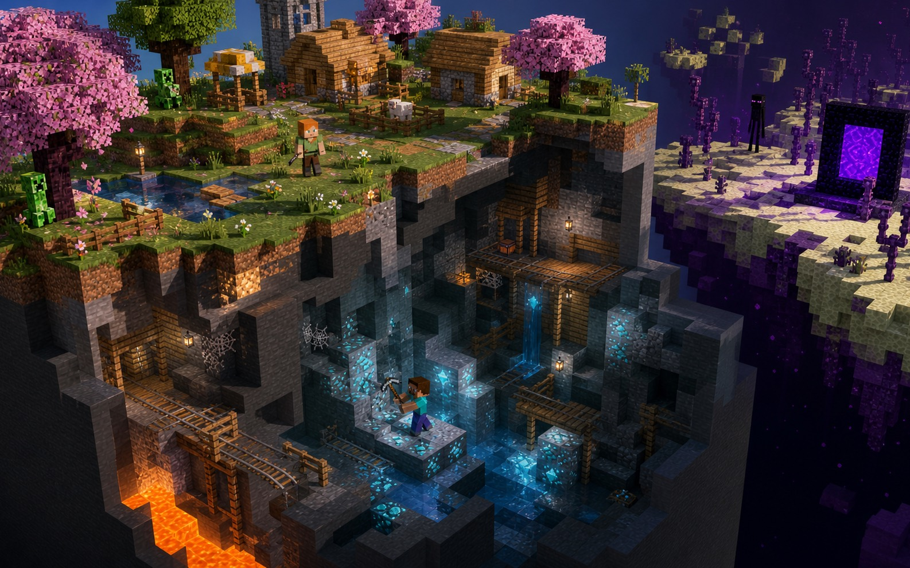 | 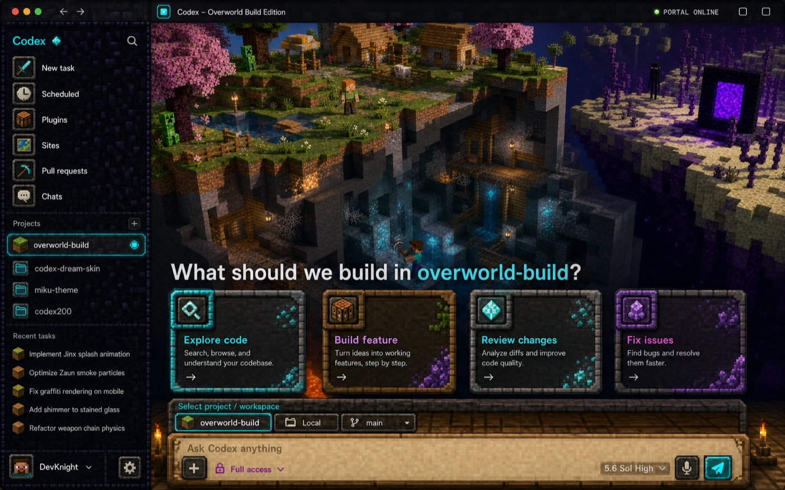 |

```bash
./bin/awesome-codex-themes switch overworld-realms
```

### 09. Mordor Runtime

> A storm-black mounted formation crossing basalt and ember fissures beneath a distant volcanic watchtower.

| Background | Marketing asset |
| --- | --- |
| 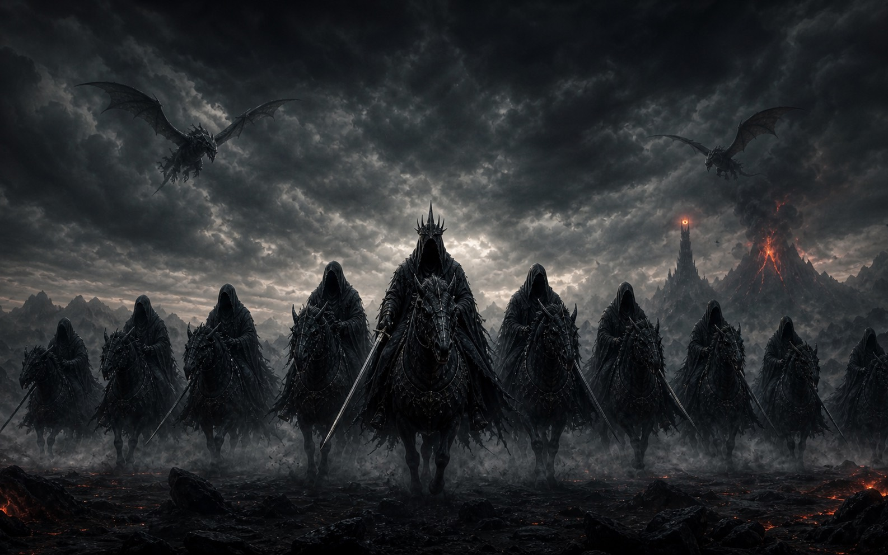 | 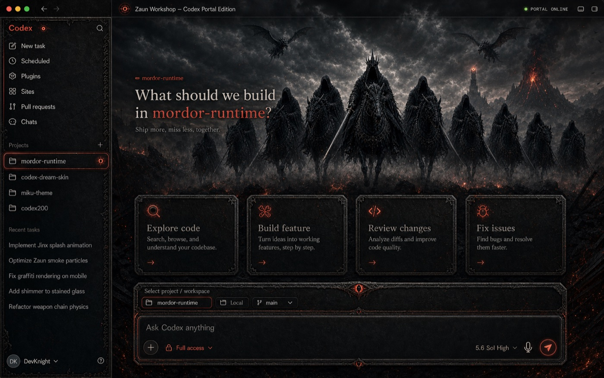 |

```bash
./bin/awesome-codex-themes switch mordor-runtime
```

### 10. Night City

> A moonlit high-rise interior overlooking a rain-blue megacity, with glass reflections and sparse magenta signal lights.

| Background | Marketing asset |
| --- | --- |
|  | 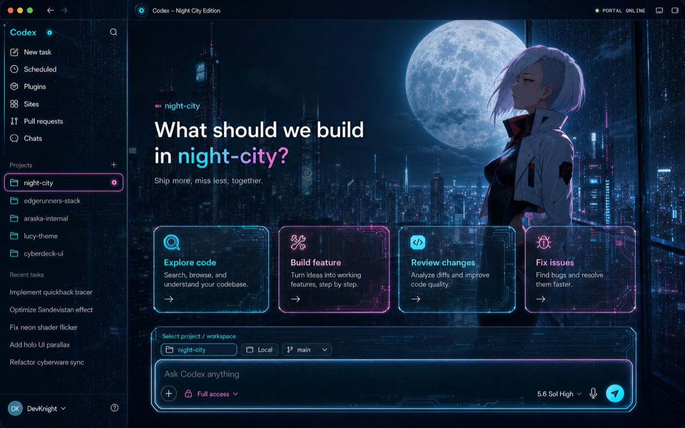 |

```bash
./bin/awesome-codex-themes switch night-city
```

### 11. Foundling Garden

> A small foundling in a misty moss garden, reinterpreted as a wider luminous sanctuary and orbital seed instrument.

| Background | Marketing asset |
| --- | --- |
|  | 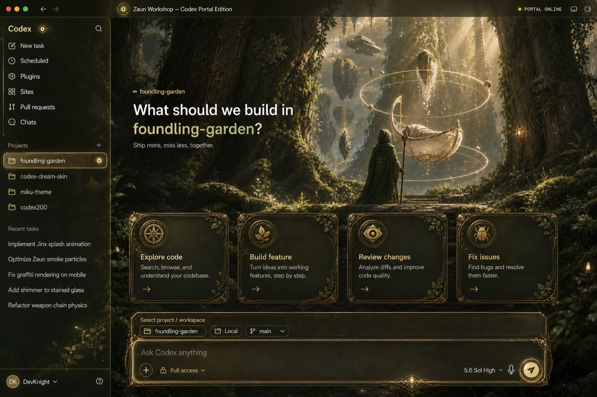 |

```bash
./bin/awesome-codex-themes switch foundling-garden
```

### 12. New World Studio

> A many-character ink-wash editorial composition over warm paper, black and red brush fields, brass flecks, blossoms, and ocean references.

| Background | Marketing asset |
| --- | --- |
|  | 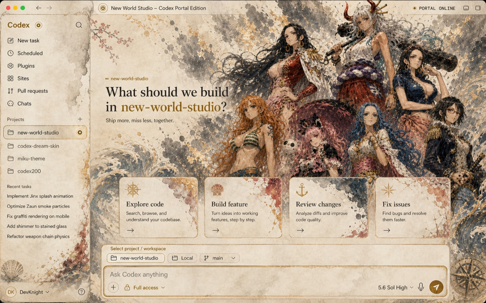 |

```bash
./bin/awesome-codex-themes switch new-world-studio
```

## Quick start

Requirements:

- macOS on the same architecture as the installed official Codex Desktop app.
- A signed official `ChatGPT.app` or legacy `Codex.app` installation.
- Any numeric Codex Desktop version. The engine attempts the shared adapter on unverified versions.

Clone the repository and run read-only checks first:

```bash
git clone https://github.com/BeatAPI/Awesome-codex-themes.git
cd Awesome-codex-themes
./bin/awesome-codex-themes doctor
./bin/awesome-codex-themes list
```

Install the Featured theme as the persistent selection:

```bash
./bin/awesome-codex-themes install-agent satoru-gojo --takeover-at-login
./bin/awesome-codex-themes status
```

`--takeover-at-login` is the explicit opt-in that keeps the theme present after a Mac reboot even when macOS restores an ordinary Codex process first. During the first 120 seconds after boot, the agent may request one normal quit of the single verified official process, confirm that exact process is gone, then reopen it through LaunchServices with the saved profile and managed local endpoint. Outside that window, without the flag, with multiple instances, or if identity/exit verification fails, the agent leaves Codex running and reports `restart-required`.

If Codex is already open during normal work, save your work and quit it yourself before the first managed launch. See [Installation and recovery](docs/INSTALL.md) before enabling persistence.

**Best-effort injection is attempted on every numeric Codex Desktop version. Highly compatible and live-verified: `26.707.*` and `26.715.*`.** Other versions are attempted, but their component layout is not guaranteed.

## Persistent lifecycle

```bash
# Select another installed theme
./bin/awesome-codex-themes switch night-city

# Return to the Featured theme
./bin/awesome-codex-themes switch satoru-gojo

# Upgrade from a newer inspected checkout
./bin/awesome-codex-themes upgrade-agent

# Stop persistent management and remove project-owned live styling
./bin/awesome-codex-themes pause

# Re-enable the saved selection
./bin/awesome-codex-themes resume

# Remove the installed agent and project-owned runtime
./bin/awesome-codex-themes uninstall-agent
```

The LaunchAgent points to an immutable installed copy, not the Git clone. It starts the official app with a local CDP endpoint, reapplies the selected theme after renderer reloads, and preserves an explicit pause, restore, and uninstall path.

After an official Codex update, the agent attempts the shared adapter again. If a changed interface looks wrong, run `pause` or `restore` to return to the official UI, then open a [GitHub Issue](https://github.com/BeatAPI/Awesome-codex-themes/issues/new/choose) with the Codex version and a privacy-safe screenshot.

## Current status

Version `0.4.4` includes the engine, twelve complete local theme packages, self-contained user installation, opt-in bounded login takeover, verification-first renderer maintenance, LaunchAgent persistence, conflict diagnostics, safe restore, and a static Gallery.

| Capability | State |
| --- | --- |
| Twelve Schema 2 theme packages | Implemented; compatibility remains experimental |
| Theme assets, CSS, metadata, and catalog validation | Implemented and tested |
| Official app identity, signature, Team ID, architecture, and port checks | Implemented and tested |
| Loopback-only apply, idempotent reapply, and owned-state removal | Implemented and prototype verified |
| Install, upgrade, switch, pause, resume, status, and uninstall | Integration verified on `26.715.21425` |
| Renderer reload and full app relaunch recovery | Integration verified on `26.715.21425` |
| Opt-in macOS login takeover | Implemented and automated; physical reboot still pending direct exercise |
| Searchable static Gallery | Implemented; deployment is separate from the repository build |

## Commands

| Command | Purpose |
| --- | --- |
| `list` | Validate and list complete runnable themes. |
| `doctor` | Inspect the signed app, exact running PIDs, and known injector conflicts without mutation. |
| `start <theme>` | Start one session-scoped managed Codex launch. |
| `install-agent <theme> [--takeover-at-login]` | Install persistence; the optional flag explicitly permits one bounded login-time handoff after reboot. |
| `upgrade-agent` | Upgrade the installed runtime while preserving theme and enabled/paused state. |
| `switch <theme>` | Validate and select another installed theme. |
| `pause` | Disable persistent management and remove project-owned live styling. |
| `resume` | Re-enable the saved persistent selection. |
| `apply <theme> --port <port>` | Apply once to an explicitly CDP-enabled official app. |
| `status` | Report desired theme, agent state, endpoint, and last safe-failure status. |
| `restore [--port <port>]` | Remove project-owned styling for a one-shot or session-scoped launch. |
| `uninstall-agent` | Boot out the user agent and delete only this project's installed files. |

## Safety model

- Validates bundle identifier `com.openai.codex`, intact code signature, and OpenAI Team ID `2DC432GLL2`.
- Uses the Node runtime bundled with the signed official app; end users do not need a global Node installation.
- Binds CDP to a dynamically selected port on literal `127.0.0.1` and verifies the listener belongs to the official process.
- Selects only the expected main `app://-/index.html` renderer.
- Applies one namespaced style element and one optional inert, pointer-transparent decorative node.
- Never reads conversations, account tokens, API keys, model settings, or unrelated user data.
- Never patches `app.asar`, modifies the signed app bundle, or uses `--user-data-dir`. Process handoff is disabled by default and is allowed only after explicit `--takeover-at-login` consent, for one verified official PID inside the bounded startup window.
- `pause`, `restore`, and `uninstall-agent` remove only project-owned runtime state.

Read [SECURITY.md](SECURITY.md), [docs/SAFETY.md](docs/SAFETY.md), and [docs/MIGRATION.md](docs/MIGRATION.md) before replacing another injector.

## Theme authoring

Each complete theme is declarative and self-contained:

```text
themes/my-theme/
├── assets/
├── theme.json
├── theme.css
├── background.jpg
├── preview.jpg
└── ASSET_LICENSE.md
```

Start with [Theme authoring](docs/THEME_AUTHORING.md) and the [theme schema](docs/THEME_SCHEMA.md). Contributors must document provenance and confirm they have the necessary rights to distribute every submitted asset.

## Gallery and development

```bash
corepack enable
pnpm install
pnpm dev
pnpm check
pnpm release:check
```

The Gallery is a static Vite build with search, filters, structured theme details, and copyable commands. It has no accounts, analytics, payments, or remote theme execution. Theme packages remain the catalog source of truth.

## Independent implementation

The runtime architecture was researched against [Codex-Dream-Skin](https://github.com/Fei-Away/Codex-Dream-Skin) and [codex-app-transfer](https://github.com/Cmochance/codex-app-transfer), both MIT licensed at the inspected commits. Awesome Codex Themes is an independent, narrower implementation; no upstream source files are included. See [THIRD_PARTY_NOTICES.md](THIRD_PARTY_NOTICES.md).

## License and trademark notice

Code is available under the [MIT License](LICENSE). Artwork source notes are recorded in each theme package.

Awesome Codex Themes is unofficial and is not affiliated with, endorsed by, or sponsored by OpenAI. “OpenAI” and “Codex” are trademarks of their respective owner. This project does not ship the official application.
